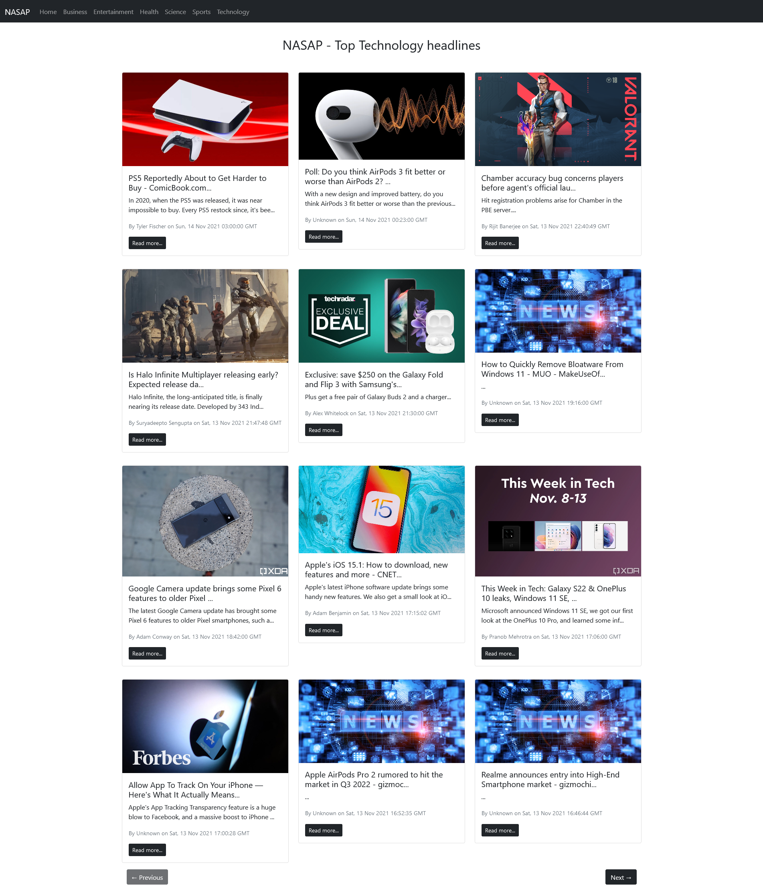

# What is this?
This is a news app made in reactjs. This uses the [NewsApi](newsapi.org) to fetch data of news and displays it in formatted manner. It also has navgation bar links to different categories of news to be displayed.

# What I learnt making this application?
- React class based components.
- To set props and state of class based components.
- To use react with external APIs for getting data.
- To extract specific pieces of data for different uses according to our needs. 

### Personal Todo
- Read the whole project for better understanding of the REACTJS class based components
- Learn javascript maps

# The working application looks something like


**NOTE:** ***apikey should be stored in .env.local file in root directory***

To setup the app, install dependencies first
```
npm i
```

To run the app in development server
```
npm start
```